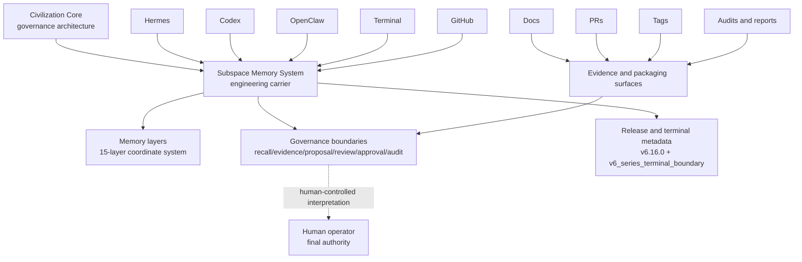

# Civilization Core Architecture Atlas / 文明之核总架构图谱

## 1. Atlas Status

This is a docs-only atlas.

It is based on the sealed `v6.16.0` Civilization Core Stable Kernel after:

- T1 Terminal Closure Pack merged;
- T2 Civilization Core Whitepaper merged;
- the v6 line reached `v6_series_terminal_boundary`.

`v6_series_terminal_boundary` is terminal metadata only. It is not a successor release, not a new implementation stage, and not a continuation target.

There is no v6.17.

This atlas does not activate runtime behavior, dependencies, adapters, dispatch, durable memory writes, Memory Graph mutation, M-Flow behavior, or authorization/execution semantics.

## 2. Top-Level Architecture Map

Civilization Core is the governance architecture.

Subspace Memory System is the engineering carrier for that architecture.

Hermes, Codex, OpenClaw, Terminal, and GitHub are operators or surfaces. They may host memory governance, code/document implementation, controlled observation, local validation, PR review, tags, and release evidence, but they are not the core itself.

Docs, PRs, tags, audits, smoke reports, and release reports are evidence and packaging surfaces. They can record, anchor, explain, validate, or package governance facts. They do not create authority by themselves.

The diagram is a structural map only. It does not imply automatic execution, autonomous control, self-authorization, hidden dispatch, or external action.

## 3. Fifteen-Layer Architecture Map

| Layer | High-level meaning | Governance role | Active-status interpretation after `v6.16.0` |
| --- | --- | --- | --- |
| 1. 星火记忆 | Initial spark: task intent, question, prompt, or raw idea. | Captures original intent without treating it as fact or authority. | Closed as part of the governance coordinate system; not a direct write or approval surface. |
| 2. 星点记忆 | Single fact, evidence point, or operation record. | Binds a point to source, time, scope, and evidence type. | Closed as point-evidence semantics; a point alone is not a system conclusion. |
| 3. 星链记忆 | Linked points forming a task chain, causal chain, or evidence chain. | Orders dependencies and makes evidence paths reviewable. | Closed as chain semantics; relationship is not authorization. |
| 4. 星图记忆 | Structured graph of modules, roles, responsibilities, or capabilities. | Makes architecture visible while preserving permission boundaries. | Closed as structural map semantics; visibility is not permission. |
| 5. 星河记忆 | Project/version evolution across multiple maps. | Preserves evolution, rollback points, and historical continuity. | Closed as version-flow semantics; history is not current validity by itself. |
| 6. 星辰记忆 | Reusable knowledge and case memory. | Turns evidence-bound conclusions into candidate knowledge. | Closed as knowledge-candidate semantics; no direct durable memory write. |
| 7. 星域记忆 | Project, role, and scenario partitioning. | Limits scope and prevents unqualified cross-context propagation. | Closed as partition semantics; no automatic cross-project transfer. |
| 8. 星穹记忆 | Governance, audit, and federation sharing. | Records review, audit, gates, and read-only sharing boundaries. | Closed as governance/audit semantics; audit is not authorization. |
| 9. 星海记忆 | Large-scale, multi-source, multi-agent memory sea. | Aggregates and compares recall across sources under governance. | Closed as recall-quality semantics; recall is not adoption or write. |
| 10. 星界记忆 | Cross-system boundary coordination. | Verifies cross-surface evidence while preserving role separation. | Closed as boundary-readiness semantics; cross-system evidence is not execution permission. |
| 11. 星枢记忆 | Routing, orchestration, and policy coordination. | Distinguishes routing readiness from real governed routing operations. | Closed as routing-governance semantics; no unapproved dispatch or tool action. |
| 12. 星律记忆 | Rules, constraints, and policy boundaries. | Defines checks, blocks, and explanations before action. | Closed as rule-boundary semantics; rules are not self-executing law. |
| 13. 星魂记忆 | Long-term preference, persona, and collaboration continuity. | Requires governed proposals for durable continuity. | Closed as proposal-gated continuity semantics; no direct long-term persona write. |
| 14. 星宙记忆 | Cross-time, cross-project, cross-ecosystem evolution. | Tracks temporal evolution without mutating config or graph state. | Closed as temporal-governance semantics; metrics are not mutation. |
| 15. 星源记忆 | Source reasoning, methodology generation, and self-evolution boundary. | Seals source-methodology reasoning as governed metadata. | Sealed governance metadata and methodology boundary only; not active runtime, not source mutation, not writer, not graph mutator, not approval engine, and not executor. |

After `v6.16.0`, the fifteen layers are read as a completed governance coordinate system. They explain how memory and governance concepts relate; they do not create new live capability.

## 4. Governance Surface Map

| Surface | What it is | What it can prove | What it cannot prove |
| --- | --- | --- | --- |
| Memory recall | Retrieval of prior context or evidence. | That relevant historical material was found. | That the material is accepted, true, current, or writable. |
| Evidence support | Source-bound facts, records, reports, or outputs. | That a claim has support that can be reviewed. | That the claim is automatically true or authorized. |
| Proposal | A structured request to consider a change or memory. | That a candidate has been formulated. | That the candidate has been approved, written, or executed. |
| Review | Human or governed inspection of a candidate. | That a candidate was inspected under stated criteria. | That execution or mutation is permitted. |
| Approval request | A request for approval. | That authority was requested. | That authority was granted. |
| Human approval | Explicit human decision under known boundaries. | That the human operator made a decision. | That future unrelated mutations are authorized. |
| Audit | Read-only inspection of facts, risks, and boundaries. | That facts and risks were checked. | That action is authorized. |
| Release integrity | Deterministic release/file/smoke boundary checks. | That required release surfaces match the expected state. | That future capability, authority, or continuation exists. |
| Stable kernel metadata | Final `v6.16.0` sealed governance identity. | That the v6 governance line closed at the Stable Kernel. | That a kernel executor, dispatcher, or live policy engine exists. |
| Terminal boundary marker | `v6_series_terminal_boundary`. | That v6 ended after `v6.16.0`. | That a roadmap continuation or successor v6 stage exists. |

Strict separations:

- recall is not write;
- evidence is not truth by itself;
- audit is not authorization;
- review is not execution;
- approval request is not approval;
- adapter declaration is not dispatch;
- source mutation proposal is not source mutation;
- stable kernel is not active runtime;
- terminal marker is not roadmap continuation;
- human sovereignty is non-transferable.

## 5. Version Architecture Map

The high-level v1-v6 arc is:

| Segment | Architecture role |
| --- | --- |
| v1-v2 | Foundational governance, boundary contracts, evidence, and approval separation. |
| v3 | Star-Soul / 星魂 continuity and handoff closure. |
| v4 | 13.5 transition corridor and governance hardening. |
| v5 | Layer 14 / 星宙 boundary and execution-adapter candidate governance. |
| v6 | Layer 15 / 星源 governance boundary and Civilization Core Stable Kernel. |

The final v6 segment is:

| Version | Terminal role |
| --- | --- |
| `v6.13.0` | Civilization Core Stability Index |
| `v6.14.0` | Source Handoff Boundary |
| `v6.15.0` | Star-Source Closure Audit |
| `v6.16.0` | Civilization Core Stable Kernel |

There is no v6.17.

`v6_series_terminal_boundary` is terminal metadata only. It is not a successor release, not a branch target, not a roadmap item inside v6, and not an implementation stage.

## 6. Execution Boundary Atlas

Execution boundaries are closed by separation:

- execution adapter declaration is candidate metadata only;
- declaration does not dispatch;
- review does not execute;
- audit does not authorize;
- the human operator retains final authority;
- there is no hidden external action;
- there is no network action without explicit operator control;
- there is no durable write without governed approval;
- there is no Memory Graph mutation without governance.

The execution-adapter candidate corridor in v5 made adapter governance visible without turning declaration, policy gate, approval gate, or authorization gate metadata into dispatch. The terminal v6 kernel preserves that same boundary. It records governance closure; it does not activate an execution surface.

## 7. Artifact / Evidence Map

| Artifact | What it can prove | What it cannot prove |
| --- | --- | --- |
| Source files | The repository contains deterministic implementation or metadata at a given revision. | That future behavior, authority, or mutation is approved. |
| Tests | Expected behavior or boundary checks pass under the tested conditions. | That untested future changes are safe or authorized. |
| Smoke scripts | A narrow command path produces the expected output. | That a broad runtime capability or execution authority exists. |
| Release integrity audits | Required files, smoke outputs, version fields, and boundary checks match release expectations. | That audit success authorizes new action. |
| PRs | Review and merge history were recorded. | That a sealed line is reopened or future mutation is approved. |
| Git tags | A release identity is anchored to a commit. | That future mutation or continuation is authorized. |
| Docs | Boundaries, architecture, intent, and interpretation are explained. | That runtime capability is created. |
| Terminal closure pack | The v6 terminal state and no-continuation boundary are recorded. | That the terminal marker is a successor roadmap. |
| Whitepaper | The governance thesis and completed architecture are explained. | That theory has become execution. |
| Architecture atlas | Structural relationships among layers, surfaces, versions, artifacts, and boundaries are mapped. | That the closed system has been reopened. |

Examples:

- A tag can anchor a release identity, but it does not authorize future mutation.
- A PR can record review and merge, but it does not reopen a sealed line.
- A smoke test can validate behavior, but it does not create authority.
- A doc can explain boundaries, but it does not create runtime capability.

## 8. Post-Terminal Documentation Map

| Item | Status after T3 creation | Meaning |
| --- | --- | --- |
| T1 Terminal Closure Pack | Merged | Records the final closed state after `v6.16.0`. |
| T2 Civilization Core Whitepaper | Merged | Explains the governance thesis and completed architecture. |
| T3 Architecture Atlas | Current | Maps the closed architecture structurally. |
| T4 Version Chronicle | Future | Records the v1-v6 version history and closure sequence. |
| T5 Boundary Constitution | Future | Consolidates authority and non-overreach rules. |
| T6 Operator Guide | Future | Explains how a human operator should read and govern the system. |
| T7 Release Book | Future | Packages release facts, tags, smoke evidence, and terminal state. |
| T8 Handoff Package | Future | Prepares transfer material without changing the kernel. |
| T9 v7 Pre-Design Decision | Future | Optional pre-design decision only; not active development. |
| T10 Productization Roadmap | Future | Productization planning outside v6 continuation. |

T4-T10 are future documentation or decision surfaces. v7 is optional pre-design only, not active development. Productization is outside v6 continuation.

## 9. M-Flow Placement Map

M-Flow Essence Absorption Boundary / 联想记忆方法论吸收边界 is placed outside the sealed v6 runtime and outside `v6.16.0`.

M-Flow is post-terminal candidate material only. It is a methodology reference only.

现在加入记录，不加入能力。

现在加入候选，不加入实现。

现在加入后封顶增强项，不加入 v6 本体。

M-Flow placement rules:

- no runtime integration;
- no dependency;
- no adapter;
- no memory writer;
- no Memory Graph mutation;
- no authorization;
- no execution;
- not part of `v6.16.0`;
- not part of v6 completion;
- not active Star-Source Memory;
- not active Layer 15.

M-Flow can be studied later only as a post-terminal enhancement candidate. It must not be imported into the sealed v6 line as capability, dependency, adapter, writer, graph mutation path, authorization mechanism, execution path, or completion requirement.

## 10. Non-Overreach Map

The system does not claim:

- autonomous authority;
- self-authorization;
- personhood;
- life;
- awakening;
- legal subject status;
- religious status;
- active Star-Source Memory runtime;
- active Layer 15 runtime;
- hidden execution;
- unauthorized durable write;
- external or network action without explicit operator control.

The architecture is a governance boundary system. It does not create delegated sovereignty, legal identity, metaphysical identity, autonomous agency, or self-granted authority.

## 11. Closed-System Reading Guide

Read the completed architecture in this order:

1. Civilization Core gives the governance constitution.
2. Subspace Memory System carries that constitution in an engineering project.
3. The fifteen memory layers provide the coordinate system.
4. Governance surfaces separate recall, evidence, proposal, review, approval, audit, release integrity, stable kernel metadata, and terminal markers.
5. The version architecture closes v1-v6 at `v6.16.0`.
6. Execution boundaries prevent metadata, reviews, audits, adapter declarations, and proposals from becoming action.
7. Artifacts package evidence without creating future authority.
8. Post-terminal docs explain, package, or decide outside v6 continuation.
9. M-Flow remains outside-runtime candidate methodology only.

This reading order keeps the atlas technical and structural while preserving the sealed kernel boundary.

## 12. Final Architecture Conclusion

Civilization Core has reached terminal governance closure at `v6.16.0`.

This Architecture Atlas explains the closed system; it does not reopen it.

`v6_series_terminal_boundary` is terminal metadata only.

There is no v6.17.

Future work must be outside v6 continuation.
