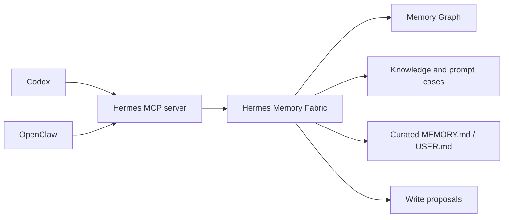

# Share Hermes Memory with Codex and OpenClaw

Hermes should remain the primary memory owner. Codex, OpenClaw, and other MCP
clients should connect to Hermes and use the same Memory Fabric instead of
keeping separate long-term memories that drift out of sync.

## Architecture



## MCP Client Config

Add Hermes as an MCP server in each client:

```json
{
  "mcpServers": {
    "hermes-memory": {
      "command": "hermes",
      "args": ["mcp", "serve"]
    }
  }
}
```

Use the same config shape for Codex, OpenClaw, Claude Code, Cursor, or any
MCP-capable client. The client manages the process lifecycle.

## Memory Tools

The Hermes MCP server exposes these shared memory tools:

- `memory_bridge_status`: inspect available memory surfaces and policy.
- `memory_fabric_search`: search Memory Graph, knowledge files, GPT image prompt cases, and curated memory.
- `memory_graph_read`: read graph nodes with provenance and optional edges.
- `memory_write_proposal`: create a governed write proposal without mutating memory.
- `memory_snapshot_export`: export a portable snapshot for backup or read-only cache.

## Write Policy

External clients must not write directly to `USER.md`, `MEMORY.md`, or the
Memory Graph. They should call `memory_write_proposal` with:

```json
{
  "source_agent": "codex",
  "target_scope": "project",
  "project": "openclaw",
  "content": "OpenClaw should retrieve prompt examples through Hermes Memory Fabric.",
  "rationale": "Shared memory setup",
  "tags": "codex,openclaw,memory"
}
```

Hermes can later review, merge, reject, or promote the proposal into durable
memory through its normal governance flow.

## Clone and Cache

Use `memory_snapshot_export` only for backup, cold start, or offline read-only
cache. A snapshot is not a new primary memory store. When a client learns
something new, it should submit a write proposal back to Hermes.

## Recommended Startup Flow

1. Client connects to `hermes-memory`.
2. Client calls `memory_bridge_status`.
3. Client searches with `memory_fabric_search`.
4. Client reads high-value graph nodes with `memory_graph_read`.
5. Client creates new durable-memory candidates with `memory_write_proposal`.

This keeps Hermes, Codex, and OpenClaw working from one shared memory fabric
without forking long-term knowledge.
